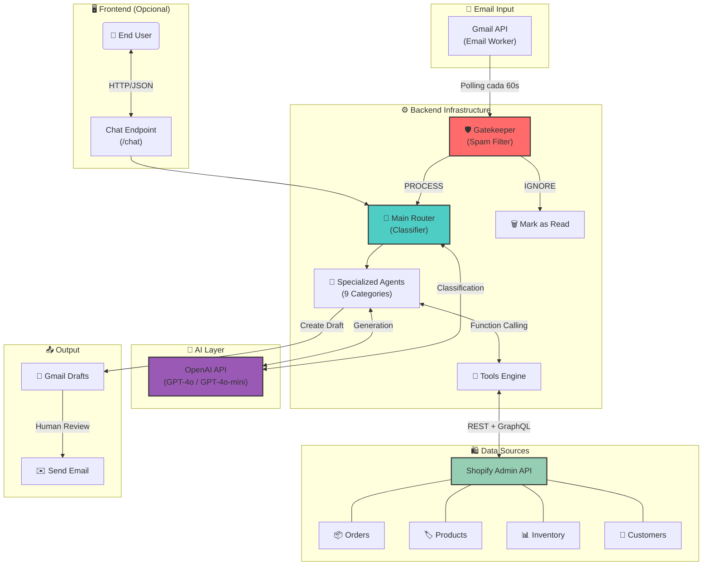

# 🤖 AI Customer Support Agent for Gmail & Shopify

<div align="center">


**Un agente de soporte al cliente autónomo que monitorea Gmail, consulta Shopify en tiempo real y redacta respuestas inteligentes.**

[Características](#-características-principales) •
[Instalación](#-instalación) •
[Configuración](#-configuración) •
[Uso](#-uso) •
[API](#-api-endpoints) •
[Personalización](#-personalización)

</div>

---

## 📋 Descripción

Este repositorio contiene un **Agente de Soporte al Cliente Autónomo** construido con **Python**, **FastAPI** y **OpenAI**.

El sistema:

- 📧 **Monitorea** una bandeja de entrada de Gmail  
- 🏷️ **Clasifica** correos entrantes por categoría  
- 🔍 **Consulta** datos en tiempo real de Shopify (pedidos, stock, políticas)  
- ✍️ **Redacta** borradores de respuesta inteligentes y personalizados  

> **⚠️ Human-in-the-loop:** Este agente **NO envía correos automáticamente**. Crea **borradores** en Gmail para revisión humana antes del envío.

---

## ✨ Características Principales

### 📧 Integración con Gmail

- Lee correos no leídos automáticamente  
- Gestiona hilos de conversación para mantener contexto  
- Crea borradores de respuesta (no envía directamente)  
- Marca correos procesados como leídos  

### 🧠 Inteligencia Contextual

- **Router inteligente** que clasifica intenciones del usuario  
- **9 categorías especializadas** de soporte  
- **Function Calling** para consultas a APIs externas  
- **Detección automática de idioma** y respuesta en el mismo idioma  

### 🛍️ Conexión Profunda con Shopify

| Funcionalidad | Descripción |
|---|---|
| 📦 Pedidos | Rastreo en tiempo real, estado de envío, tracking |
| 📊 Inventario | Stock por variante, alertas de agotado |
| 🏷️ Metafields | Instrucciones de lavado, materiales, compresión |
| 👤 Clientes | Perfil VIP, LTV, historial de compras |
| 💰 Descuentos | Códigos activos, reglas de precio |
| 📜 Políticas | Devoluciones, envíos, términos |

### 🛡️ Seguridad y Anti‑Spam

- Filtrado de dominios maliciosos y phishing  
- Detección de correos B2B/Marketing  
- Bloqueo de emails automatizados del sistema  
- Validación de email para consultas de pedidos  

---

## 🏗️ Arquitectura



### Flujo de Procesamiento

```text
Email Worker detecta correo no leído
↓
Gatekeeper filtra spam/phishing
↓
Router clasifica categoría (9 tipos)
↓
Agente especializado procesa con contexto de tienda
↓
Tools ejecutan consultas a Shopify (si necesario)
↓
Se genera respuesta en idioma del cliente
↓
Borrador creado en Gmail → Humano revisa y envía
```

---

## 📁 Estructura del Proyecto

```text
AI-Customer-Support-Agent/
├── main.py               # Aplicación principal (FastAPI + Workers)
├── requirements.txt      # Dependencias Python
├── .env.example          # Plantilla de variables de entorno
├── .gitignore            # Archivos ignorados por Git
├── README.md             # Esta documentación
└── docs/                 # Documentación adicional
    ├── SETUP_GMAIL.md
    └── SETUP_SHOPIFY.md
```

---

## 🚀 Instalación

### Requisitos Previos

- **Python** 3.10 o superior  
- **Cuenta de Shopify** con acceso a Admin API  
- **API Key de OpenAI** (recomendado: GPT‑4 o GPT‑4o‑mini)  
- **Proyecto en Google Cloud** con Gmail API habilitada (opcional, para Email Worker)  

### Paso 1: Clonar el Repositorio

```bash
git clone https://github.com/hitthecodelabs/AI-Customer-Support-Agent.git
cd AI-Customer-Support-Agent
```

### Paso 2: Crear Entorno Virtual

```bash
# Crear entorno virtual
python -m venv venv

# Activar entorno
# Linux/macOS:
source venv/bin/activate

# Windows:
venv\Scripts\activate
```

### Paso 3: Instalar Dependencias

```bash
pip install -r requirements.txt
```

### Paso 4: Configurar Variables de Entorno

```bash
# Copiar plantilla
cp .env.example .env

# Editar con tus credenciales
nano .env  # o tu editor preferido
```

---

## ⚙️ Configuración

### Variables de Entorno

Crea un archivo `.env` basándote en `.env.example`:

```ini
# ═══════════════════════════════════════════════════════════
# SHOPIFY - Configuración de la tienda
# ═══════════════════════════════════════════════════════════
SHOPIFY_URL=tu-tienda.myshopify.com
SHOPIFY_TOKEN=shpat_xxxxxxxxxxxxxxxxxxxxxxxxxxxxxxxx
SHOPIFY_API_VERSION=2025-10

# ═══════════════════════════════════════════════════════════
# OPENAI - Modelo de IA
# ═══════════════════════════════════════════════════════════
OPENAI_API_KEY=sk-xxxxxxxxxxxxxxxxxxxxxxxxxxxxxxxx
OPENAI_MODEL=gpt-5-mini  # Opciones: gpt-5, gpt-5.1, gpt-5-mini

# ═══════════════════════════════════════════════════════════
# SEGURIDAD - Autenticación del endpoint /chat
# ═══════════════════════════════════════════════════════════
AGENT_SECRET=tu-secret-seguro-aqui

# ═══════════════════════════════════════════════════════════
# GMAIL - Credenciales OAuth (opcional, para Email Worker)
# ═══════════════════════════════════════════════════════════
# JSON en una sola línea con las credenciales OAuth
GOOGLE_TOKEN_JSON={"token":"...","refresh_token":"...","client_id":"...","client_secret":"...","token_uri":"https://oauth2.googleapis.com/token"}

# ═══════════════════════════════════════════════════════════
# WORKER - Configuración del procesamiento de emails
# ═══════════════════════════════════════════════════════════
EMAIL_CHECK_INTERVAL=60  # Segundos entre verificaciones
```

---

## 🔑 Configuración de Shopify

1. Accede a tu Admin de Shopify → **Settings** → **Apps and sales channels**
2. Crear App personalizada:
   - Click en **Develop apps**
   - **Create an app** → nombra tu app
3. En **API credentials**, configura los scopes:

```text
read_orders, read_products, read_inventory,
read_customers, read_price_rules, read_policies
```

4. Instalar y obtener token:
   - Click en **Install app**
   - Copia el **Admin API access token** (empieza con `shpat_`)
5. Configura en `.env`:

```ini
SHOPIFY_URL=tu-tienda.myshopify.com
SHOPIFY_TOKEN=shpat_xxxxxxxxxxxxxxxxxxxxx
```

---

## 📧 Configuración de Gmail (Opcional)

Solo necesario si quieres habilitar el worker de emails automático.

### Paso 1: Crear Proyecto en Google Cloud

- Ve a Google Cloud Console
- Crea un nuevo proyecto
- Habilita la **Gmail API**

### Paso 2: Crear Credenciales OAuth

- Ve a **APIs & Services** → **Credentials**
- **Create Credentials** → **OAuth client ID**
- Tipo: **Desktop application**
- Descarga el archivo `credentials.json`

### Paso 3: Generar Token (Una sola vez, local)

Ejecuta este script **localmente** para autenticarte:

```python
# generate_token.py
from google_auth_oauthlib.flow import InstalledAppFlow
import json

SCOPES = [
    "https://www.googleapis.com/auth/gmail.readonly",
    "https://www.googleapis.com/auth/gmail.modify",
    "https://www.googleapis.com/auth/gmail.compose",
]

flow = InstalledAppFlow.from_client_secrets_file("credentials.json", SCOPES)
creds = flow.run_local_server(port=0)

print(
    json.dumps(
        {
            "token": creds.token,
            "refresh_token": creds.refresh_token,
            "token_uri": creds.token_uri,
            "client_id": creds.client_id,
            "client_secret": creds.client_secret,
        }
    )
)
```

```bash
python generate_token.py
```

### Paso 4: Configurar Variable de Entorno

Copia el JSON generado (en una sola línea) a tu `.env`:

```ini
GOOGLE_TOKEN_JSON={"token":"ya29.xxx","refresh_token":"1//xxx","client_id":"xxx.apps.googleusercontent.com","client_secret":"xxx","token_uri":"https://oauth2.googleapis.com/token"}
```

---

## 🎮 Uso

### Desarrollo Local

```bash
# Con hot-reload
uvicorn main:app --reload --port 8000
```

### Producción

```bash
uvicorn main:app --host 0.0.0.0 --port 8000
```

### Con Docker (Opcional)

`Dockerfile`:

```dockerfile
FROM python:3.11-slim
WORKDIR /app
COPY requirements.txt .
RUN pip install --no-cache-dir -r requirements.txt
COPY . .
CMD ["uvicorn", "main:app", "--host", "0.0.0.0", "--port", "8000"]
```

Build + Run:

```bash
docker build -t ai-support-agent .
docker run -p 8000:8000 --env-file .env ai-support-agent
```

---

## 🔌 API Endpoints

### Health Check

```http
GET /
```

Respuesta:

```json
{
  "status": "online",
  "email_worker": "active"
}
```

### Health Check Detallado

```http
GET /health
```

Respuesta:

```json
{
  "status": "healthy",
  "shopify_configured": true,
  "openai_configured": true,
  "gmail_configured": true,
  "version": "1.0.0"
}
```

### Chat Endpoint

```http
POST /chat
Content-Type: application/json
X-Secret: tu-agent-secret
```

Body:

```json
{
  "message": "¿Dónde está mi pedido #1234?",
  "history": []
}
```

Respuesta:

```json
{
  "response": "¡Hola! 💛 He encontrado tu pedido #1234...",
  "category": "ShippingDelivery",
  "history": [
    { "role": "user", "content": "¿Dónde está mi pedido #1234?" },
    { "role": "assistant", "content": "¡Hola! 💛 He encontrado tu pedido #1234..." }
  ]
}
```

---

## 🧠 Categorías del Router

El agente clasifica automáticamente cada mensaje en una de estas categorías:

| Categoría | Descripción | Ejemplo de trigger |
|---|---|---|
| OrderPlacementStatus | Estado de pedidos | “¿Recibieron mi orden?” |
| ShippingDelivery | Envíos y tracking | “¿Dónde está mi paquete?” |
| ReturnsCancellationsExchanges | Devoluciones | “Quiero cancelar” |
| PaymentBilling | Pagos y facturación | “Me cobraron dos veces” |
| ProductInfoAvailability | Info de productos | “¿Tienen talla M?” |
| TechnicalIssues | Problemas técnicos | “No puedo pagar” |
| PromotionsDiscountsPricing | Descuentos | “Mi código no funciona” |
| CustomerComplaintsSatisfaction | Quejas | “Servicio terrible” |
| AccountProfileOther | Otros | “Cambiar contraseña” |

---

## 🛠️ Tools Disponibles (Function Calling)

El agente puede ejecutar estas herramientas automáticamente:

| Tool | Descripción |
|---|---|
| lookup_order_crm | Busca pedido + perfil del cliente |
| lookup_order_admin | Estado de pedido en tiempo real |
| lookup_product_intelligence | Stock + metafields del producto |
| lookup_product_stock | Inventario con GraphQL |
| escalate_ticket_to_support | Crea ticket de escalación |

---

## 🎨 Personalización

### Ajustar el Tono del Agente

Edita `COMMON_TONE` en `main.py`:

```python
COMMON_TONE = r'''
TONE & PERSONA:
- You are "Princess Carolyne", the Customer Success Manager at TuMarca.
- Tone: Friendly, professional, solution-oriented.
- Use emojis: 💛, 🙏, 😊
...
'''
```

### Agregar Nuevas Categorías

1. Añade la categoría a `AGENT_CATEGORIES`
2. Crea el prompt en `AGENT_PROMPTS`
3. El router la detectará automáticamente

### Configurar Filtros de Spam

Edita `EmailSecurityConfig`:

```python
class EmailSecurityConfig:
    BLOCKED_DOMAIN_PATTERNS = [
        "spam-domain.com",
        "phishing-site.net",
    ]

    INTERNAL_PARTNERS = [
        "tu-proveedor.com",
        "tu-agencia.com",
    ]
```

### Integrar Sistema de Tickets

Implementa `_create_ticket_internal`:

```python
async def _create_ticket_internal(category, email, summary, priority):
    # Integración con Zendesk, Freshdesk, etc.
    async with httpx.AsyncClient() as client:
        response = await client.post(
            "https://tu-sistema.zendesk.com/api/v2/tickets",
            json={"ticket": {"subject": summary, "...": "..."}},
            headers={"Authorization": "Bearer xxx"},
        )
    return {"ticket_id": response.json()["id"]}
```

---

## ☁️ Despliegue

### Railway

1. Conecta tu repositorio de GitHub  
2. Configura las variables de entorno en el dashboard  
3. Railway detecta automáticamente el `Procfile` o usa:

```bash
uvicorn main:app --host 0.0.0.0 --port $PORT
```

### Render

- Build Command: `pip install -r requirements.txt`  
- Start Command: `uvicorn main:app --host 0.0.0.0 --port $PORT`

### Fly.io

```bash
fly launch
fly secrets set OPENAI_API_KEY=sk-xxx SHOPIFY_TOKEN=shpat_xxx ...
fly deploy
```

---

## 🐛 Troubleshooting

### El worker de email no inicia

```text
ℹ️ [Email Worker] Deshabilitado (GOOGLE_TOKEN_JSON no configurado)
```

Solución: Verifica que `GOOGLE_TOKEN_JSON` esté correctamente configurado en `.env`.

### Error de token expirado de Gmail

```text
❌ [Gmail] Error refrescando token
```

Solución: Regenera el token ejecutando `generate_token.py` localmente.

### Shopify retorna 401

Solución:

- Verifica que el token empiece con `shpat_`
- Confirma que la app tiene los scopes necesarios

### Rate Limits de OpenAI

Solución: Reduce el modelo a `gpt-4o-mini` o implementa retry con backoff.

---

## 📊 Métricas Recomendadas

- Tiempo de respuesta promedio por categoría  
- Tasa de escalación a humanos  
- Distribución de categorías de emails  
- Errores de tools (Shopify timeouts, etc.)  

---

## 🤝 Contribuir

1. Fork el repositorio  
2. Crea una rama: `git checkout -b feature/nueva-funcionalidad`  
3. Commit: `git commit -m "Agrega nueva funcionalidad"`  
4. Push: `git push origin feature/nueva-funcionalidad`  
5. Abre un Pull Request  

---

## 📄 Licencia

Este proyecto está bajo la licencia MIT. Ver `LICENSE` para más detalles.

---

## 🙏 Agradecimientos

- OpenAI por la API de GPT  
- FastAPI por el framework  
- Shopify por la documentación de su API  

<div align="center">

¿Preguntas o sugerencias? Abre un issue.

⭐ Si este proyecto te fue útil, considera darle una estrella.

</div>
